# Positioning 101

### Ejercicio A
###### Si usted tiene tres elementos estáticamente posicionados en el código,estos se apilarán uno encima de otro:
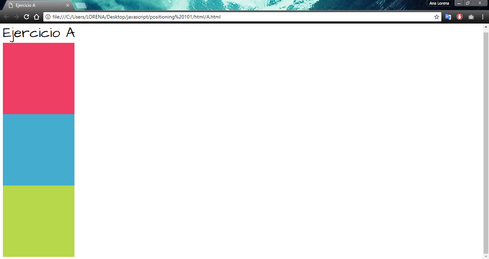

### Ejercicio B
###### Se demuestra que los elementos relativamente posicionados, se comportan exactamente de la misma manera que los elementos estáticamente posicionado:
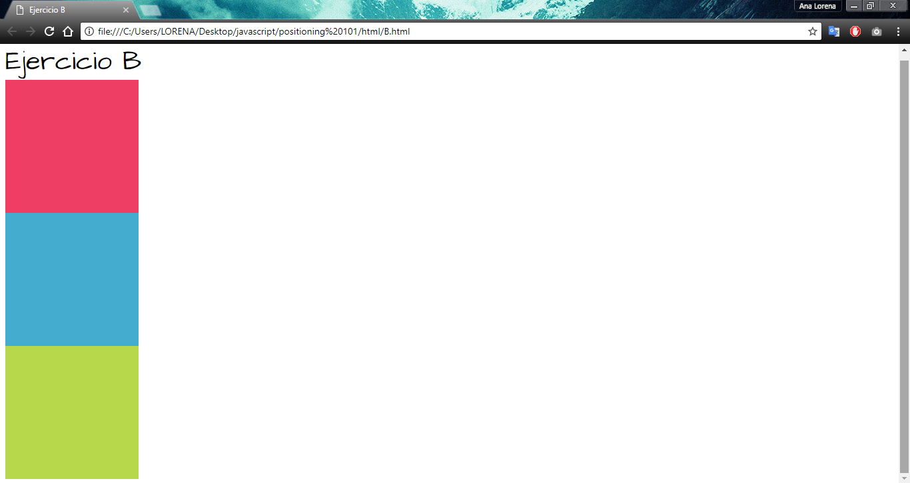

### Ejercicio C
###### Los tres bloques del ejemplo B se apilan muy bien, pero esta vez el bloque azul es empujado hacia fuera 200 píxeles desde la izquierda.
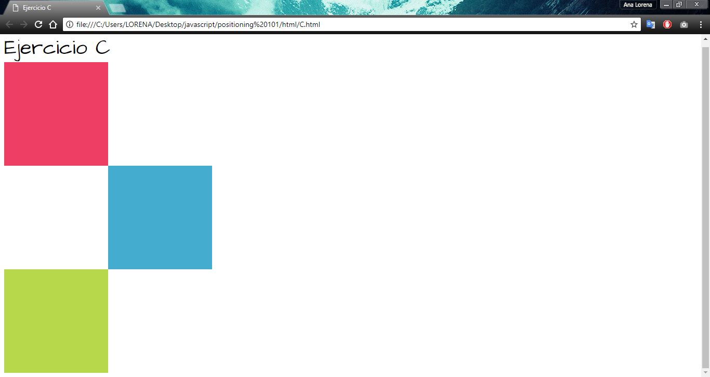

### Ejercicio D
###### Ahora la modificacion no se hara en el css, sino que realizaremos los cambios en el html para mover box_2 dentro de box_1. Debido al nuevo sistema de coordenadas, el bloque azul mide su desplazamiento 200px desde la izquierda del bloque rojo (box_1) en lugar del documento:
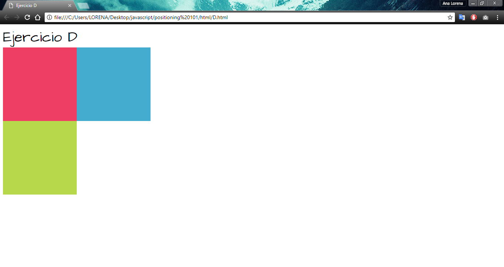

### Ejercicio E
###### Se muestran 4 cajas, cada una en una esquina de la ventana del navegador. Desde que se modifico cada valor de posicion de la caja en el css como "absolute", creamos basicamente un cuadro con velcro en cada esquina de la ventana del navegador. A medida que cambia el tamaño de esta ventana, estas cajas seguiran en sus respectivas esquinas.

### Ejercicio F
###### En este ejercicio se colocaran cajas pequeñas de color naranja dentro los cuadros creados en el ejercicio E,  para esto, se crea una clase llamada .orange la cual ira dentro de cada box. en el html:
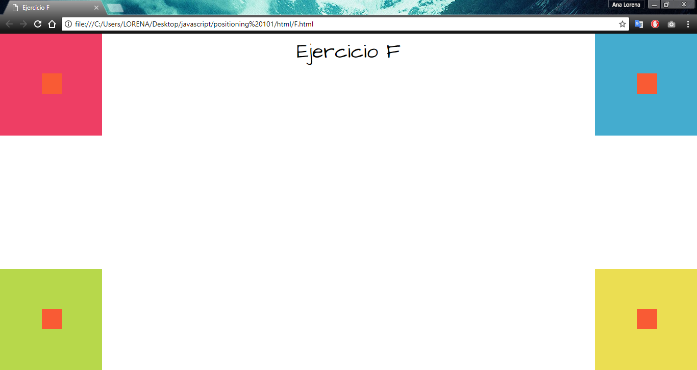

### Ejercicio G
###### Se crea un desplazamiento de borde de 10px en el documento el cual fluye completamente a medida que cambia el tamaño del documento gracias a los posicionamientos y desplazamientos:
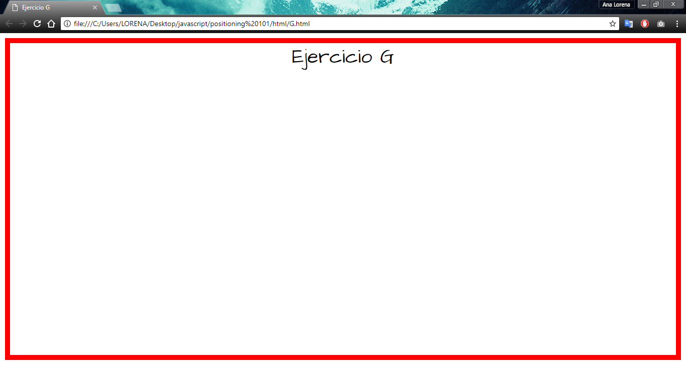

### Ejercicio H
###### Muestra el diseño de pantalla completa con dos columnas. Si bien es probable que este no sea el mejor enfoque para un diseño de dos columnas, aún muestra la potencia que tiene el valor ABSOLUTO:
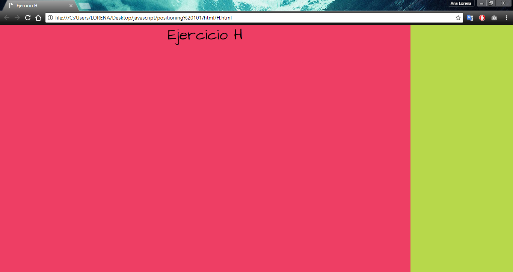

### Ejercicio H2
###### En el ejemplo H2, concéntrese en el bloque azul (# box_2). Observe cómo se usa solo un desplazamiento:
 left: 100px;
###### Esto permite que el elemento # box_2 mantenga su borde superior y aún cambie 100 píxeles hacia la izquierda:
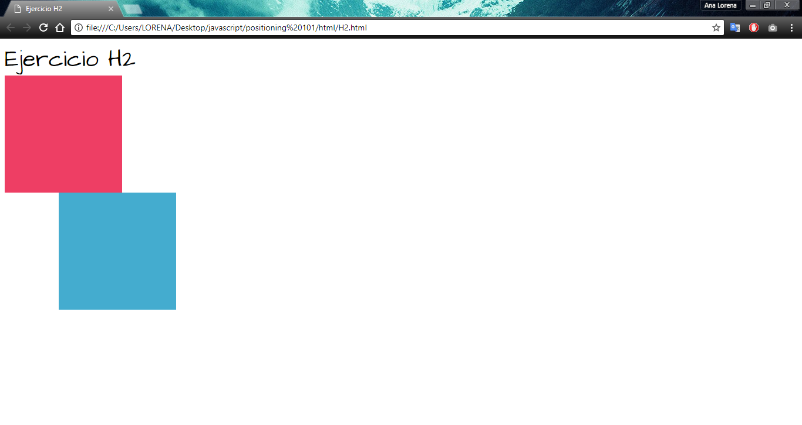

### Ejercicio H3
###### Si aplicamos un segundo desplazamiento en la parte superior, veríamos que nuestro bloque azul (# box_2) se coloca en la parte superior del documento:
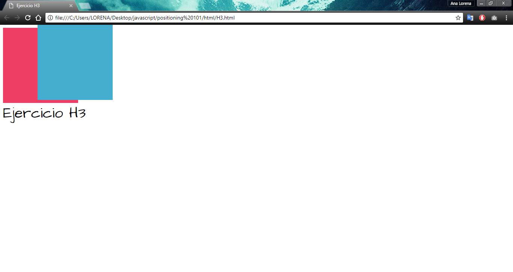

### Ejercicio I
###### El Ejemplo I muestra un pie de página con texto de copyright como elemento fijo. Mientras te desplazas, observa que no se mueve.
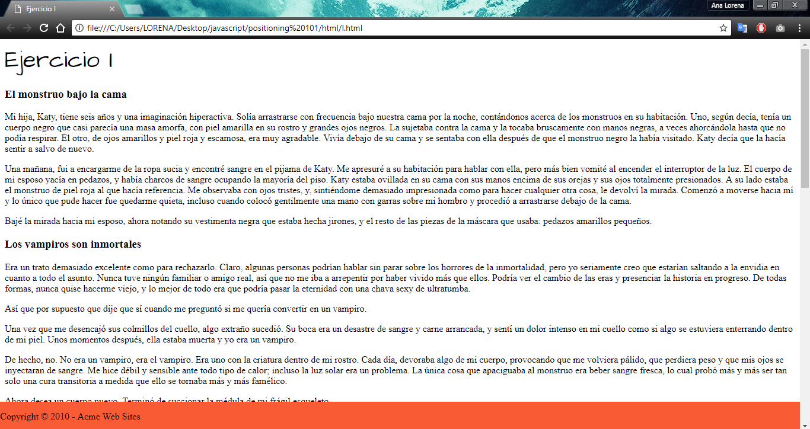

### Ejercicio J
###### El ejemplo J muestra un diseño de sitio web típico con encabezado, navegación, contenido y pie de página:
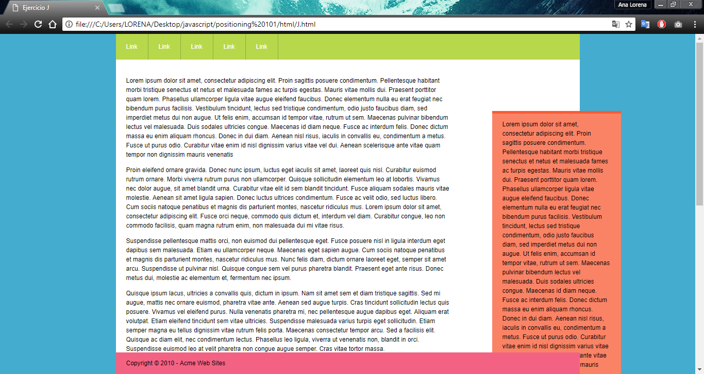
